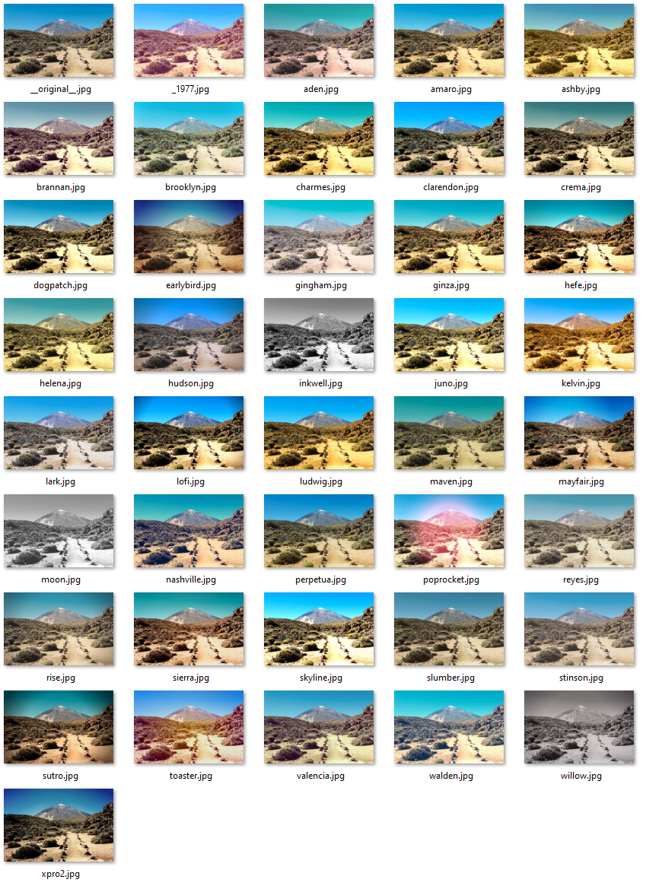

# pilgram

[](https://python.org/pypi/pilgram2)
[](https://python.org/pypi/pilgram2)
[](https://github.com/mgrl/pilgram2/actions/workflows/ci.yml)
[](https://codecov.io/gh/mgrl/pilgram2)

A python library for instagram filters.



The filter implementations are inspired by [CSSgram](https://una.im/CSSgram/).

## Requirements

- Python >= 3.4
- [Pillow](https://pillow.readthedocs.io/en/stable/) or [pillow-simd](https://github.com/uploadcare/pillow-simd)
- [NumPy](https://numpy.org)

## Install

```sh
pip install pillow>=4.1.0 # or pip install pillow-simd
pip install numpy
pip install pilgram2
```

## Usage

Available instagram filters on `pilgram2`:

- `_1977`
- `aden`
- `brannan`
- `brooklyn`
- `clarendon`
- `earlybird`
- `gingham`
- `hudson`
- `inkwell`
- `kelvin`
- `lark`
- `lofi`
- `maven`
- `mayfair`
- `moon`
- `nashville`
- `perpetua`
- `reyes`
- `rise`
- `slumber`
- `stinson`
- `toaster`
- `valencia`
- `walden`
- `willow`
- `xpro2`

```python
from PIL import Image
import pilgram2

im = Image.open('sample.jpg')
pilgram2.aden(im).save('sample-aden.jpg')
```

Similarly, pilgram2 provides css filters and blend modes as a by-product.

Available css filters on `pilgram2.css`:

- `contrast`
- `grayscale`
- `hue_rotate`
- `saturate`
- `sepia`

```python
from PIL import Image
import pilgram2.css

im = Image.open('sample.jpg')
pilgram2.css.sepia(im).save('sample-sepia.jpg')
```

Available blend modes on `pilgram2.css.blending`:

- `color`
- `color_burn`
- `color_dodge`
- `darken`
- `difference`
- `exclusion`
- `hard_light`
- `hue`
- `lighten`
- `multiply`
- `normal`
- `overlay`
- `screen`
- `soft_light`

```python
from PIL import Image
import pilgram2.css.blending

backdrop = Image.open('backdrop.jpg')
source = Image.open('source.jpg')
pilgram2.css.blending.color(backdrop, source).save('blending.jpg')
```

## Performance


## Test

```sh
pipenv install --dev
make test     # pytest
make test-tox # pytest with tox
```
